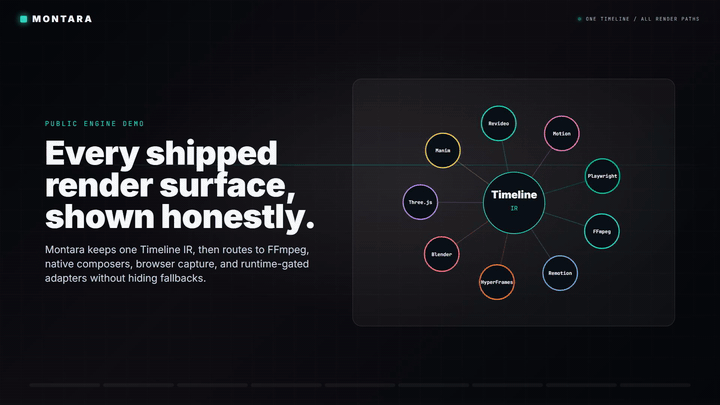
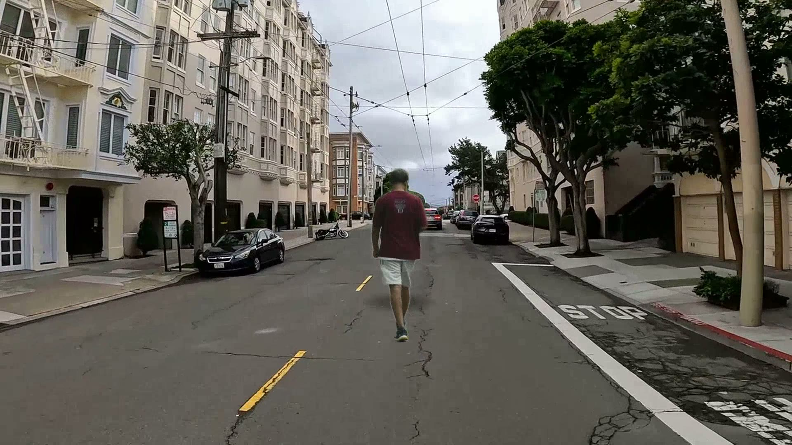
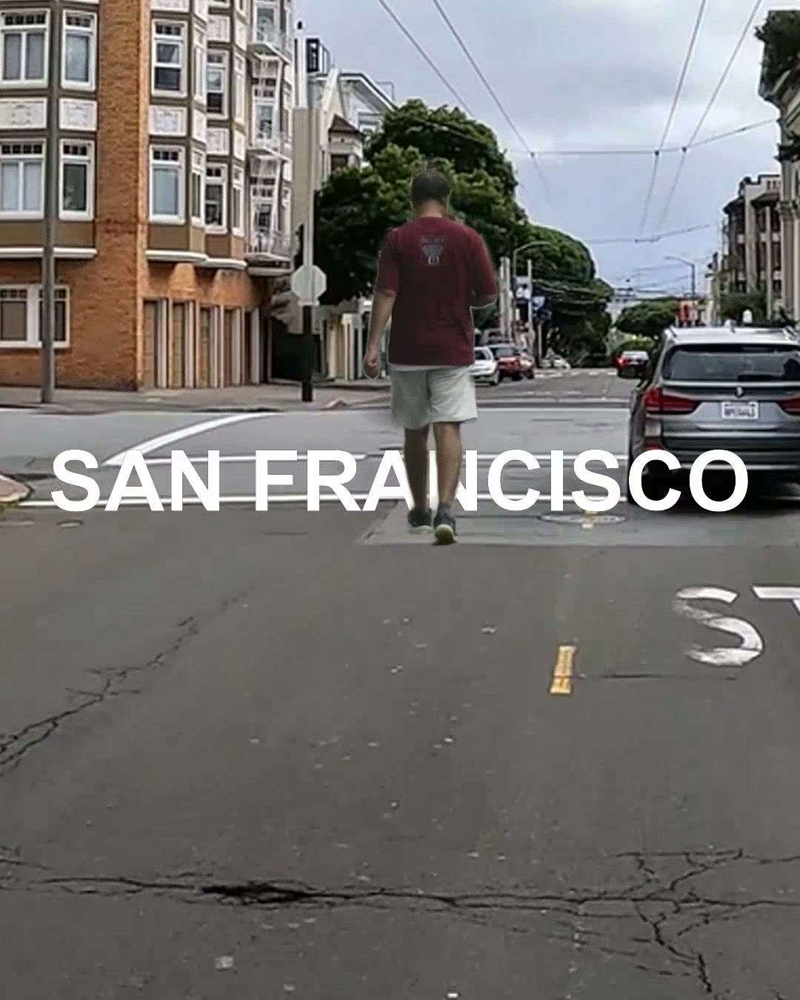
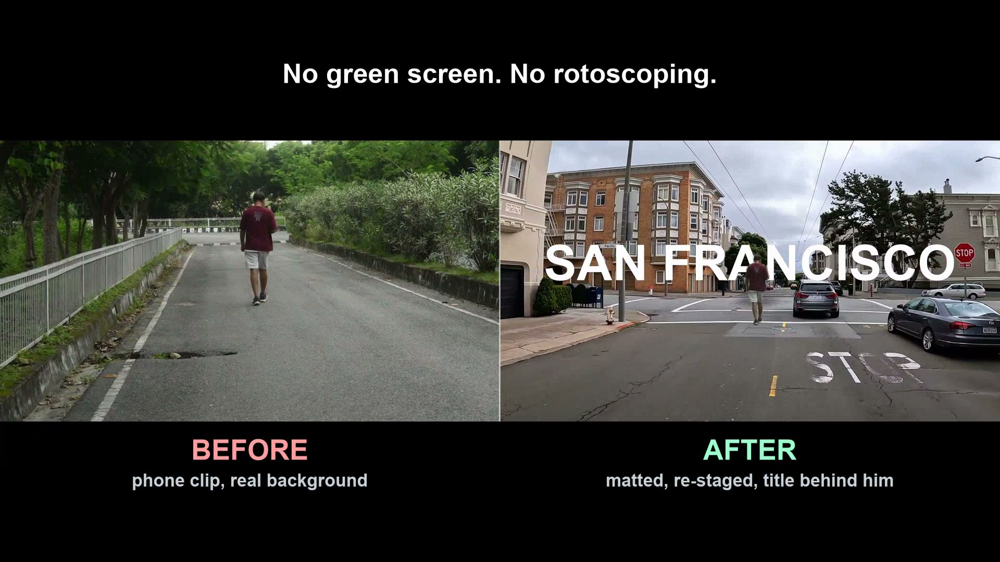
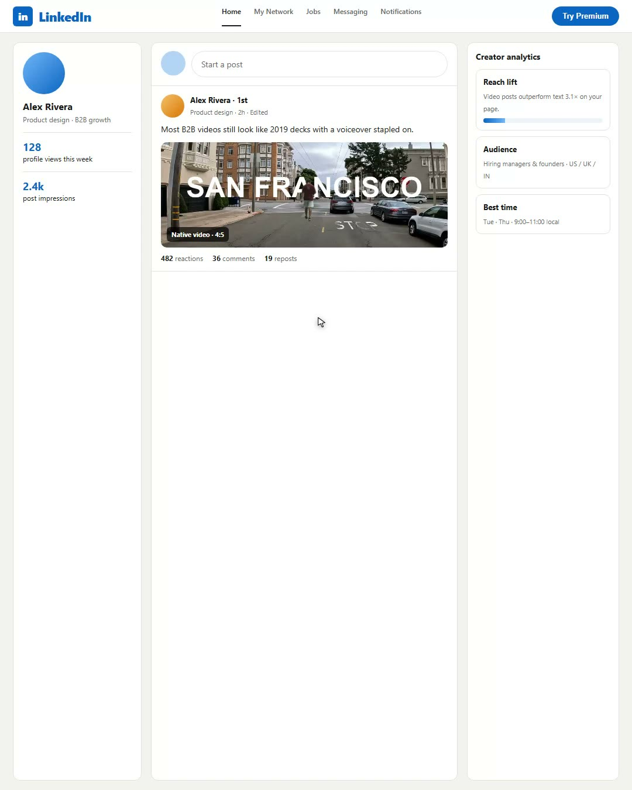
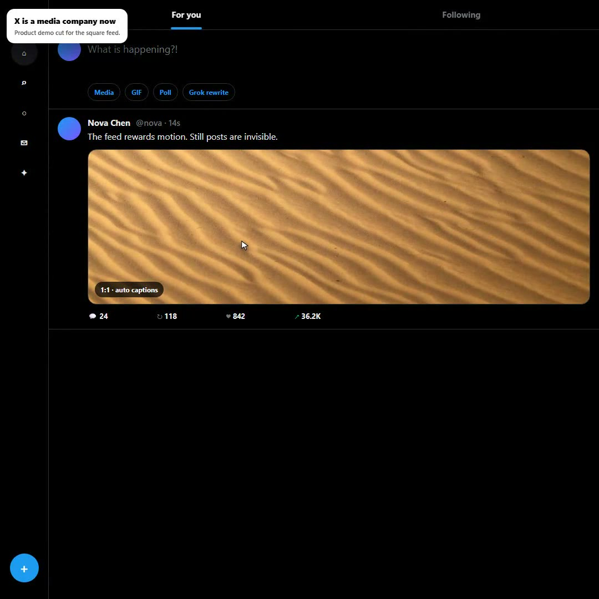

<p align="center">
  <a href="https://raw.githubusercontent.com/abhinavshrivastava950/Montara/main/demos/01-engine-matrix.mp4">
    
  </a>
  <br/>
  <a href="https://raw.githubusercontent.com/abhinavshrivastava950/Montara/main/demos/01-engine-matrix.mp4">Watch/download the full engine matrix MP4</a>
</p>

<h1 align="center">Montara</h1>

<p align="center">
  <strong>Local-first video studio OS.</strong><br/>
  One Timeline IR. Many renderers. Real MP4s. Honest provider and runtime gates.
</p>

<p align="center">
  <a href="#quick-start">Quick Start</a> |
  <a href="#what-montara-is">What It Is</a> |
  <a href="#what-is-tested-today">Tested Today</a> |
  <a href="#provider-surface">Providers</a> |
  <a href="#repository-layout">Layout</a> |
  <a href="#roadmap">Roadmap</a> |
  <a href="docs/ARCHITECTURE.md">Architecture</a>
</p>

---

Montara is an open, agent-ready video production system for making explainers,
reels, software demos, documentaries, trailers, motion graphics, and eventually
long-form films from one editable source of truth: the **Timeline IR**.

The idea is simple and very large:

> Give creators and AI agents a local-first video engine that can plan, assemble,
> render, QA, revise, and hand off video projects without locking the project
> inside one cloud tool.

Today Montara already renders real local MP4s, exports editor files, runs a
Python media engine, verifies many provider request shapes, and ships public demo
artifacts. The larger ambition is to scale the same IR and pipeline system from
30-second shorts to 12-minute documentaries and hour-long films. That long-form
ambition is a roadmap item, not a claim that every feature-length workflow is
fully production-tested today.

## What Montara Is

Montara is built around a few hard choices:

| Principle | What it means |
| --- | --- |
| **One Timeline IR** | Scene plans, edit decisions, imported editor cuts, and generated assets resolve into one JSON timeline. |
| **Local-first** | With zero API keys, Montara still creates watchable MP4s using FFmpeg, caption cards, local/system voice paths, and deterministic fallbacks. |
| **Provider-pluggable** | Cloud providers are BYOK. Montara builds and audits request specs, but live paid calls require explicit opt-in. |
| **Renderer-honest** | FFmpeg is the universal floor. Remotion, HyperFrames, Blender, Three.js, Manim, Motion Canvas, Revideo, Playwright, and local model runtimes are used only when available. |
| **Agent-ready** | Humans, Codex, Cursor, local models, or Montara's own orchestrator read the same `skills/`, operate through the same CLI, and leave verifiable artifacts. |
| **Editor-friendly** | Renders can export EDL, OTIO, and FCPXML so work can continue in Premiere, Resolve, or Final Cut. |
| **Documentary-grade honesty** | Claims, maps, music cues, transcript cut points, and source footage are treated as quality gates, not vibes. |

## What It Can Aim To Make

Montara is designed as a general video production substrate, not a single-format
demo app.

| Format | Current truth |
| --- | --- |
| Animated explainers | Tested through `montara make`, Timeline IR, FFmpeg/Remotion fallback, and validate MP4s. |
| YouTube Shorts / Reels | Tested through reel helpers, vertical output profiles, transcript-bound cut gates, and demo artifacts. |
| Documentary montage | Tested with offline fixture corpus and a 60-second open-stock proof. Live publication footage depends on source adapters and licensing review. |
| Screen demos / product walkthroughs | Tested via capture artifact pickup and browser-capture CLI surfaces. Live Playwright recording is runtime-gated. |
| Kinetic typography | HyperFrames strict smoke is validate-gated when runtime is present; Motion Canvas native proof remains runtime-gated. |
| Character animation | SVG/GSAP rig to HyperFrames final MP4 is validate-gated when HyperFrames is present. |
| 3D / math / cinematic scenes | Three.js, Blender, Manim, Revideo, Motion Canvas adapters exist; native proof quality varies by installed runtime. |
| Long documentaries and movies | The IR, pipelines, corpus, provider, and runtime layers are designed for this. Full 12-minute/1-hour production workflows still need longer-form validation, shot continuity, asset budgeting, and heavier QA. |

## Quick Start

Prerequisites:

- Node.js 18+; Node 22+ recommended for some runtime tooling
- `pnpm`
- FFmpeg and ffprobe on `PATH`
- Python 3.10+ for the Python media engine

```bash
git clone https://github.com/abhinavshrivastava950/Montara.git
cd Montara
pnpm install
python -m pip install -r requirements/dev.txt
copy .env.example .env
pnpm run montara doctor
pnpm run montara start
```

Windows shortcut:

```bat
scripts\setup.bat
```

`pnpm run montara start` runs `doctor` first, so missing FFmpeg or workspace
dependencies are caught before a render starts. Use `pnpm run montara doctor
--fix` for guided setup commands, or `pnpm run montara doctor --fix --yes` to
run project-local install steps.

PowerShell-friendly commands:

```powershell
pnpm run montara doctor
pnpm run montara status --json --out out/montara-status.json
pnpm run montara make --pipeline animated-explainer --seconds 20 "Explain Montara's Timeline IR"
```

No API key is required for the basic local path. Add keys only for the providers
you want to test.

## Studio Flow

`montara start` is the beginner-facing entry point:

```text
Montara is started.
What can I do for you today?

  1. Create videos
  2. Edit videos

How would you like to make your video?
  1. Instagram Reel
  2. YouTube Short
  3. YouTube video
  4. Documentary
  5. Animated explainer
  6. Screen demo
```

Non-interactive example:

```bash
pnpm run montara start --non-interactive create \
  --kind documentary \
  --niche geopolitics \
  --topic "Why chokepoints still shape global trade" \
  --seconds 60
```

## Public Demo Gallery

Committed MP4s live under `demos/*.mp4` (allowlisted in `.gitignore`). Working
renders and caches stay under `out/` and are not committed. The old low-motion
text-card clips were removed from the public gallery.

### Engine proofs

| Demo | What it proves | Preview |
| --- | --- | --- |
| Full engine matrix | Chaptered FFmpeg / Remotion / HyperFrames / Blender / Three.js / Manim / Revideo / Motion Canvas / Playwright status | [GIF](demos/previews/01-engine-matrix-preview.gif) · [MP4](https://raw.githubusercontent.com/abhinavshrivastava950/Montara/main/demos/01-engine-matrix.mp4) · [poster](demos/posters/01-engine-matrix-poster.jpg) |
| Documentary studio | Remotion documentary UI, d3-geo map motion, evidence framing, FFmpeg mux | [MP4](https://raw.githubusercontent.com/abhinavshrivastava950/Montara/main/demos/02-documentary-studio.mp4) · [poster](demos/posters/02-documentary-studio-poster.jpg) |

### Craft reel (Timeline IR + compositor)

Sources: `demos/01-relight.mjs` … `demos/05-audio.mjs`. Run with `node demos/run.mjs`.

| Demo | What it proves | MP4 |
| --- | --- | --- |
| Relight / matte | RVM (or YOLO→SAM 2) subject matte, ground plate, text reveal behind the subject | 16:9 [03-relight.mp4](https://raw.githubusercontent.com/abhinavshrivastava950/Montara/main/demos/03-relight.mp4) · [poster](demos/posters/03-relight-poster.jpg) |
| Relight / matte, 4:5 | The **same Timeline IR** delivered at a second aspect — reframed, not letterboxed | 4:5 [03-relight-4x5.mp4](https://raw.githubusercontent.com/abhinavshrivastava950/Montara/main/demos/03-relight-4x5.mp4) · [poster](demos/posters/03-relight-4x5-poster.jpg) |
| Background removal, before / after | The receipt for the matte: raw phone clip vs re-staged shot, side by side and time-aligned | [11-bg-compare.mp4](https://raw.githubusercontent.com/abhinavshrivastava950/Montara/main/demos/11-bg-compare.mp4) · [poster](demos/posters/11-bg-compare-poster.jpg) |
| Camera | Ken Burns / drone-style `zoom`+`pan` on stills | [04-camera.mp4](https://raw.githubusercontent.com/abhinavshrivastava950/Montara/main/demos/04-camera.mp4) · [poster](demos/posters/04-camera-poster.jpg) |
| Cut | Word-locked cuts driven by voice timing | [05-cut.mp4](https://raw.githubusercontent.com/abhinavshrivastava950/Montara/main/demos/05-cut.mp4) · [poster](demos/posters/05-cut-poster.jpg) |
| Depth | Layered text + subject depth composite | [06-depth.mp4](https://raw.githubusercontent.com/abhinavshrivastava950/Montara/main/demos/06-depth.mp4) · [poster](demos/posters/06-depth-poster.jpg) |
| Audio | Multiband voice restore A/B vs broadband enhance, −14 LUFS master | [07-audio.mp4](https://raw.githubusercontent.com/abhinavshrivastava950/Montara/main/demos/07-audio.mp4) · [poster](demos/posters/07-audio-poster.jpg) |

The relight pair is the clearest statement of the core bet: **one Timeline IR, many
deliveries.** `03-relight.mp4` (1920×1080) and `03-relight-4x5.mp4` (1080×1350) are the
same 9.37s edit re-resolved per aspect — the subject stays framed and the matte still
holds the title behind him. Neither is a letterboxed crop of the other.

### Product / SaaS films (authored in Montara)

CapCut-style UI tours recorded with Playwright (`demos/saas/`), then cut in Montara.

| Demo | Aspect | MP4 |
| --- | --- | --- |
| Montara Studio tour | 16:9 | [08-montara-studio.mp4](https://raw.githubusercontent.com/abhinavshrivastava950/Montara/main/demos/08-montara-studio.mp4) · [poster](demos/posters/08-montara-studio-poster.jpg) |
| LinkedIn product film | 4:5 | [09-linkedin.mp4](https://raw.githubusercontent.com/abhinavshrivastava950/Montara/main/demos/09-linkedin.mp4) · [poster](demos/posters/09-linkedin-poster.jpg) |
| X product film | 1:1 | [10-x.mp4](https://raw.githubusercontent.com/abhinavshrivastava950/Montara/main/demos/10-x.mp4) · [poster](demos/posters/10-x-poster.jpg) |

<p align="center">
  <a href="https://raw.githubusercontent.com/abhinavshrivastava950/Montara/main/demos/01-engine-matrix.mp4">
    
  </a>
  <br/>
  
  <br/>
  <em>Same edit, two aspects — the title stays behind the subject in both.</em>
  <br/>
  
  <br/>
  
  <br/>
  
  
</p>

The engine matrix is deliberately honest: it demonstrates FFmpeg and Remotion as
local render paths, and it shows HyperFrames, Blender, Three.js, Manim, Revideo,
Motion Canvas, and Playwright with their actual shipped adapter/probe/runtime
status. It does not fake a native Blender, Manim, Revideo, or Motion Canvas
render when that runtime is not installed.

### Vision models (background removal and friends)

Background removal is **not** a single fixed checkpoint — `montara matte` /
`autoMatte` pick the best path the machine can run:

| Family | Role | Variants | Why / when |
| --- | --- | --- | --- |
| **RVM** (Robust Video Matting) | Primary **background removal** for video | `rvm-mobilenetv3` (CPU-friendly default), `rvm-resnet50` (higher edge/hair fidelity, needs GPU) | Purpose-built for **temporally stable** video mattes without a green screen. Preferred over still-image removers that flicker frame-to-frame. |
| **SAM 2.1** | Promptable / tracked masks (roto), not first-line BG removal | `sam2.1-hiera-tiny` → `small` → `base-plus` → `large` | Click/box/auto masks with video tracking (`montara segment`). Also used as **YOLO-seeded fallback** when RVM is unavailable. |
| **YOLO11** | Detection + auto-framing prompts | `yolo11n` → `s` → `m` → `x` | Finds subjects to seed SAM 2 or drive framing (`montara detect`). Not a matting model by itself. |
| **Chromakey** | Last-resort fallback | FFmpeg `chromakey` | Real green/blue screen only; no learned weights. |

Order for `autoMatte`: **RVM → YOLO+SAM 2 → optional chromakey → opaque**. Weights stay outside the repo; `montara models plan` / hardware gates refuse downloads the machine cannot run. Licenses: RVM GPL-3.0 (weights on their model card), SAM 2 Apache-2.0, YOLO11 AGPL-3.0 (Ultralytics).

### Audio models (source separation)

Vision separates picture layers; **Demucs** separates audio layers. Reach for it when the voice and
the music are already baked into one file — an EQ cannot unmix a mix.

| | **Multiband enhance** (`montara enhance`) | **Source separation** (`montara hear stems`) |
| --- | --- | --- |
| Input | one dirty voice take | a full mix (VO + music + room) |
| Splits by | **frequency bands** — clean each band's noise | **content** — into separate tracks |
| Output | still **one** cleaned waveform | **multiple** files you can mute, duck, or rebalance |
| Needs | FFmpeg only | Python + Demucs weights (RAM/VRAM gated, like RVM) |

```bash
montara hear stems mix.wav out/stems --two-stems vocals   # vocals + no_vocals
```

Verified end-to-end on Montara's own demo mix: separating narration-over-music and transcribing each
stem returns the full 25-word VO from `vocals.wav` and **silence** from `no_vocals.wav`. Runtime-gated
like every model path — without `pip install demucs`, `montara enhance` remains the always-available
floor and the separation command says so instead of failing. See
[`skills/creative/source-separation.md`](skills/creative/source-separation.md).

Regenerate engine-gallery demos:

```bash
pnpm demos:generate
```

Regenerate the craft / SaaS reel (needs FFmpeg; optional ElevenLabs / Pexels keys in `.env`):

```bash
node demos/run.mjs
# or one film: node demos/07-linkedin.mjs
```

The gallery generator uses only keys present in `.env`. It does not require paid
voice/music APIs; `MONTARA_TTS_PROVIDER=system` is the default demo voice path.

## What Is Tested Today

Local gate snapshot, measured 2026-08-08 on Windows 11 / Node 22 / Python 3.13:

| Gate | Result |
| --- | --- |
| `pnpm typecheck` | 0 errors |
| `pnpm verify` | 403 passed, 0 failed |
| `pnpm validate` | 102 passed, 0 failed |
| `pnpm run montara doctor` | ready to render |
| `pnpm run montara stage1-audit --json --out out/stage1-audit.json` | 4/4 sections, 21/21 checks |
| `python -m pytest tests` | not rerun on this pass — the local Python 3.13 interpreter has no `pytest`; last recorded Stage 4 gate was 399 passed, 8 skipped |

`verify` is pure/offline assertions; `validate` renders real MP4s and re-probes them,
so it is the slower gate and the one that catches a broken encoder path.

These tests cover:

- Timeline IR validation, editing operations, render paths, and editor bridge export/import
- FFmpeg real MP4 rendering and post-render QA
- Remotion native smoke when installed and FFmpeg fallback when not
- HyperFrames kinetic and character-rig paths when available
- provider request builders, redaction, dry-run/live-audit plumbing
- local fallbacks for video/image/speech/music
- corpus/search/compose workflows for documentary montage
- Playwright/capture command surfaces and Python capture tests
- documentary evidence gates and transcript-safe short cuts

Not fully tested yet:

- real live-key confirmation for every cloud provider
- full feature-length movie workflows
- installed-runtime native proofs for every renderer on every OS
- BLIP/default local vision captioning beyond optional CLIP/signalstats paths
- public SDK and GUI/WARCUT product surfaces

## Provider Surface

Montara exposes many provider paths, but it is careful about the word
"supported":

- **Verified offline:** request shape, redaction, fallback behavior, and dry-run
  ledger are tested.
- **Live confirmed:** a real key was used recently and a sanitized artifact was
  recorded.
- **Runtime-gated:** it works only if you installed the local runtime or model.
- **Planned:** the architecture has a slot, but it should not be sold as shipped.

Current registry surface:

| Category | Providers / runtimes | Current truth |
| --- | --- | --- |
| Video cloud | Kling, Runway Gen-4.5, Google Veo 3.1, xAI Grok Video, Higgsfield, MiniMax, HeyGen | request builders + sanitized fixtures; real-key confirmations still BYOK follow-up |
| Video local | WAN, Hunyuan, CogVideo, LTX via ComfyUI | runtime manager and request surface; actual quality depends on local GPU/models |
| Stock video | Pexels, Pixabay, Wikimedia | Pexels/Pixabay key paths; Wikimedia keyless network opt-in |
| Image cloud | BFL FLUX.2, Google Gemini image, xAI Grok image, OpenAI Images, Recraft | request builders + sanitized fixtures; live confirmation per key |
| Image local/stock | Stable Diffusion via ComfyUI/A1111, Manim frames, Pexels, Pixabay, Unsplash | runtime/stock gated |
| TTS | system voice, Piper, ElevenLabs, Google TTS, OpenAI TTS, Doubao Speech in Python tools | system/local fallbacks tested; cloud request builders and tools require keys |
| Music/SFX | tone-score fallback, Suno, ElevenLabs Music, ElevenLabs SFX | fallback tested; cloud paths BYOK/live-audit gated |
| STT/captions | Groq Whisper when key exists, faster-whisper when installed | Groq path is implemented; local faster-whisper remains runtime-gated |
| Source separation | Demucs (`htdemucs`, `htdemucs_ft`, `mdx_extra`) | local-only, no key; runtime-gated on `pip install demucs`, weights fetched on first run |

Before spending money, run:

```bash
pnpm run montara providers audit --out out/provider-audit-fixtures.json
pnpm run montara providers live-audit --out out/provider-live-audit.json
pnpm run montara providers smoke flux --category image --json
```

Live calls require:

```bash
MONTARA_LIVE_PROVIDER_SMOKE=1
```

plus the provider key and `--live`.

## Environment

Copy `.env.example` to `.env`. The example file intentionally lists more than
the demo minimum so a founder, evaluator, or agent can see the provider surface.
Empty values are safe; Montara falls back locally when keys are absent.

Never commit `.env`, auth state files, model weights, customer media, or private
generated outputs.

## Core Commands

```bash
pnpm run montara doctor
pnpm run montara status --json --out out/montara-status.json
pnpm run montara stage1-audit --json --out out/stage1-audit.json
pnpm run montara start
pnpm run montara plan "Make a 45-second explainer about why the sky is blue"
pnpm run montara make --brain --seconds 20 "Make a local-first documentary cold open"
pnpm run montara render out/timeline.json
pnpm run montara import out/edit.fcpxml
pnpm run montara export out/timeline.json --to otio out/edit.otio
pnpm run montara analyze https://example.com/reference-video
pnpm run montara understand source.mp4 --vision auto
pnpm run montara hear stems mix.wav out/stems --two-stems vocals
pnpm run montara reel source.mp4 out/short.mp4 --style cinematic
pnpm run montara capture login --url https://example.com
pnpm run montara capture --url https://example.com out/browser-capture.mp4
pnpm run montara corpus sources
pnpm run montara runtimes status --json --out out/runtimes-status.json
pnpm run montara providers live-audit --out out/provider-live-audit.json
```

## Engines And Runtimes

| Engine/runtime | Role | Current status |
| --- | --- | --- |
| FFmpeg | universal assembly, encode, probe, audio, thumbnails, shorts | working local floor |
| Remotion | React motion graphics, explainer/documentary compositions | native smoke validate-gated when composer deps installed; `REMOTION_ENABLED=1` opts in |
| HyperFrames | HTML/CSS/GSAP kinetic typography and character SVG rigs | validate-gated when `npx hyperframes` resolves |
| Blender | external 3D rendering | adapter exists; native runtime-gated |
| Three.js | headless/WebGL 3D proofs | adapter exists; runtime-gated/fallback path |
| Manim | math/diagram animation | adapter exists; runtime-gated |
| Revideo | MIT composition fallback target | selector/probe exists; installed MP4 proof pending |
| Motion Canvas | kinetic typography target | adapter/probe exists; installed MP4 proof pending |
| Playwright | browser capture, login storageState | CLI and tests exist; live browser runtime-gated |
| ComfyUI / A1111 | local image/video model servers | external runtime manager, dry-run install/launch guidance |
| Piper / faster-whisper / Transformers.js | local TTS, STT, CLIP-style vision | runtime inventory and optional paths |

Montara never vendors model weights. Keep runtimes, caches, and model licenses
outside the repository.

## Architecture

```text
idea/source/reference
  -> research / understand / hear
  -> pipeline skills
  -> ScenePlan / edit decisions
  -> Timeline IR
  -> renderer adapter
  -> MP4 + QA + self-review
  -> optional EDL / OTIO / FCPXML
```

The Python engine at repo root (`tools/`, `lib/`, `pipeline_defs/`, `schemas/`)
is driven through `engine_bridge.py` and the TypeScript CLI. The TypeScript side
owns the IR, provider registry, render adapters, gates, and public command
surface.

## Repository Layout

The root stays intentionally small. Runtime-critical entrypoints remain at the
top level, while reference docs and helper scripts live under their own folders.

| Path | What belongs there |
| --- | --- |
| `README.md`, `PLAN.md`, `AGENTS.md`, `AGENT_GUIDE.md` | first-read project and agent contracts |
| `packages/` | TypeScript workspaces: CLI, IR, renderers, providers, quality gates |
| `tools/`, `lib/`, `schemas/`, `pipeline_defs/`, `skills/` | Python media engine and shared skill layer; kept at root for bridge compatibility |
| `remotion-composer/` | native Remotion composition project and demo compositions |
| `scripts/` | verification, validation, demo generation, and legacy demo render helpers |
| `docs/` | architecture, provider docs, prompt gallery, attribution, launch notes |
| `demos/` | checked-in public MP4s, posters, and demo manifest only |
| `out/`, `projects/`, `.python-packages/`, `.pnpm-store/` | local generated/runtime state; ignored |

## Roadmap

What is already solid:

- Timeline IR core
- FFmpeg render floor
- editor export/import
- Stage 1 parity audit
- provider request fixtures and live-readiness ledger
- public demo gallery
- documentary evidence gates
- local-brain fallback path for `montara make --brain`

What still needs hardening:

- real BYOK live smokes for the long-tail cloud providers
- Motion Canvas and Revideo installed-runtime MP4 proofs
- full cached local CLIP/BLIP vision validation
- longer documentary/film-scale workflows with continuity and budget QA
- public SDK
- `montara serve` web GUI
- WARCUT desktop GUI on the same IR

## Repository Hygiene

Tracked on purpose:

- source code, skills, docs, schemas, tests
- public demo MP4s/posters in `demos/`
- demo manifest and reproducible generator script

Ignored on purpose:

- `.env`, auth state, service-account files, API tokens
- `out/`, `projects/`, scratch outputs, private generated media
- model weights, ONNX/GGUF files, runtime caches
- demo scratch workspace `demos/.work/` and demo generation logs

## Important Docs

- [PLAN.md](PLAN.md): master build plan and staged roadmap
- [CONTRIBUTING.md](CONTRIBUTING.md): human developer setup and PR guide
- [AGENT_GUIDE.md](AGENT_GUIDE.md): operating contract for assistants
- [docs/CAPABILITY-SNAPSHOT.md](docs/CAPABILITY-SNAPSHOT.md): what works now
- [docs/MONTARA-PARITY.md](docs/MONTARA-PARITY.md): parity/moat checklist
- [docs/PROVIDER-AUDIT.md](docs/PROVIDER-AUDIT.md): provider fixture and live-smoke policy
- [docs/DEMOS.md](docs/DEMOS.md): proof ledger
- [docs/PROMPT_GALLERY.md](docs/PROMPT_GALLERY.md): prompts that exercise real paths
- [docs/PROJECT_CONTEXT.md](docs/PROJECT_CONTEXT.md): architecture conventions

## Acknowledgements

Conceptual thanks to `calesthio/OpenMontage` and the Claude video-skills
ecosystem for helping shape the local-first video-agent direction. Montara's
public Timeline IR, TypeScript workspace, CLI, runtime gates, and demo packaging
are built as Montara.

## License

Montara is AGPL-3.0. See [LICENSE](LICENSE), [NOTICE](NOTICE), and
[docs/ATTRIBUTION.md](docs/ATTRIBUTION.md).

Do not commit secrets, private customer media, third-party model weights, or
provider outputs whose license does not allow public redistribution.
